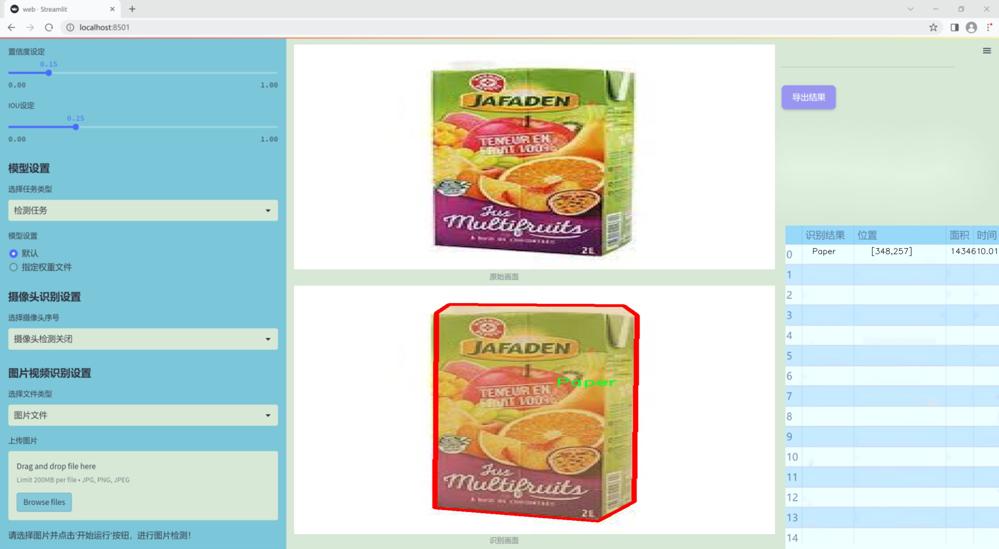
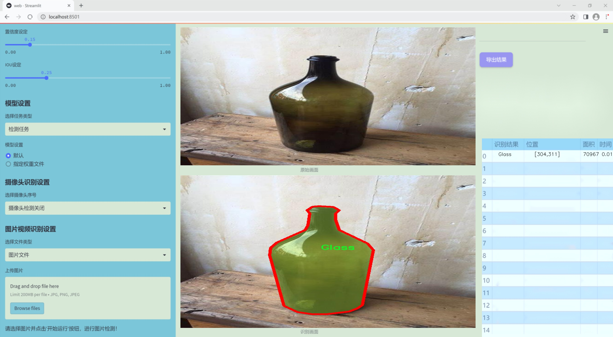
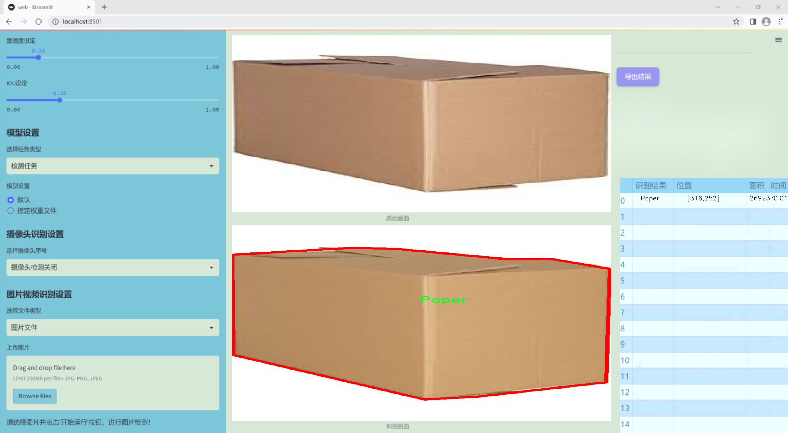
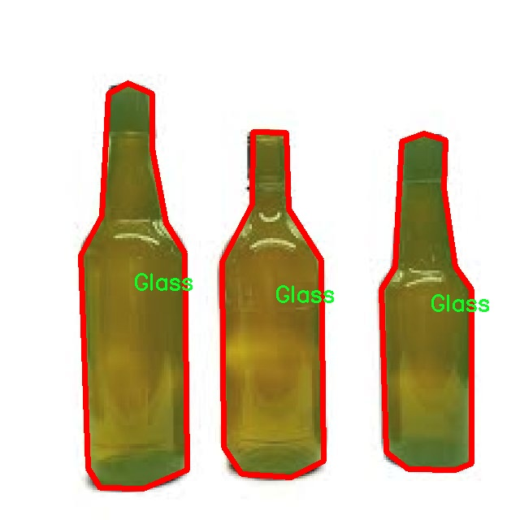
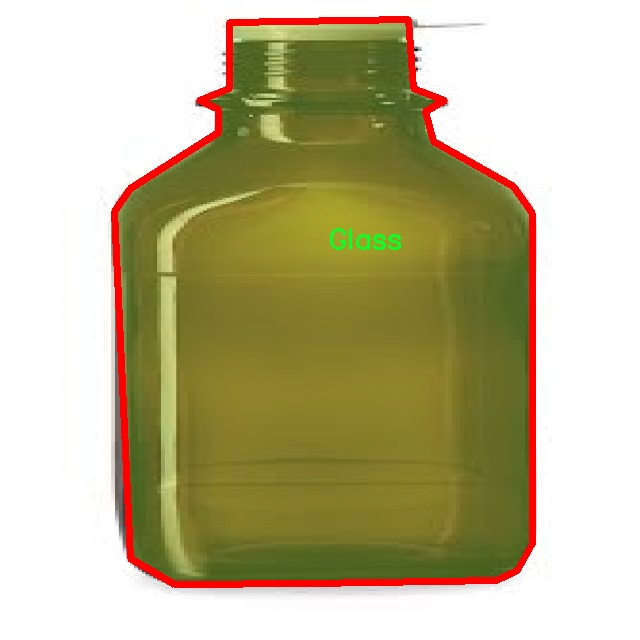
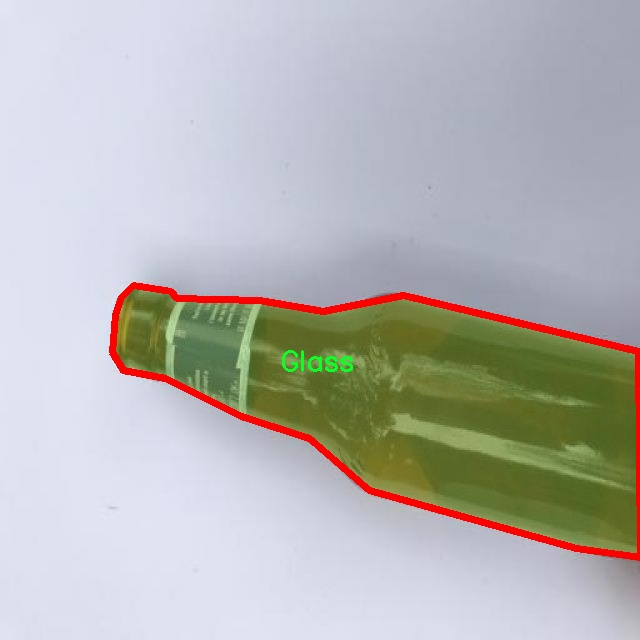
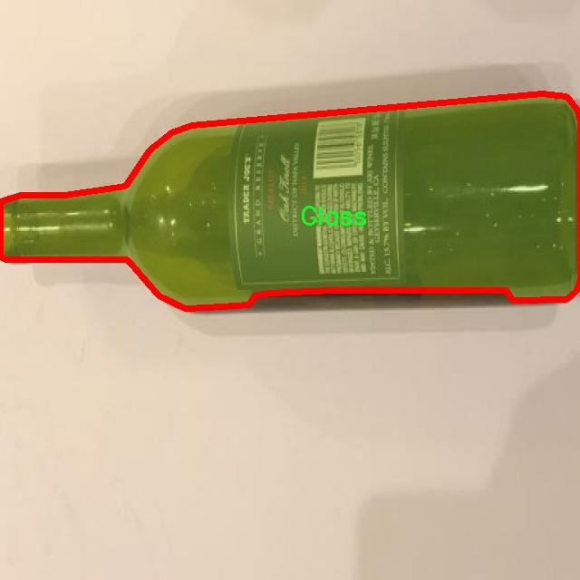
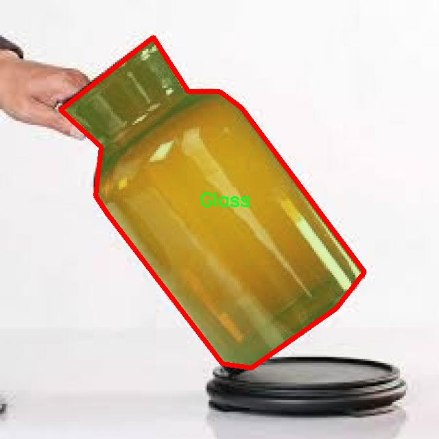

### 1.背景意义

研究背景与意义

随着城市化进程的加快和人口的增加，垃圾处理问题日益严重，成为全球范围内亟待解决的环境问题之一。根据联合国环境规划署的报告，全球每年产生的垃圾量已超过20亿吨，其中可回收物品的比例相对较高。有效的垃圾分类不仅可以减少填埋场的负担，还能促进资源的循环利用，降低环境污染。因此，建立高效的垃圾分类检测系统显得尤为重要。

近年来，深度学习技术在计算机视觉领域取得了显著进展，尤其是目标检测算法的快速发展为垃圾分类提供了新的解决方案。YOLO（You Only Look Once）系列算法因其高效性和实时性，成为目标检测任务中的热门选择。YOLOv11作为该系列的最新版本，结合了更为先进的特征提取和分类技术，能够在复杂环境中实现高精度的目标检测。然而，针对垃圾分类的特定需求，YOLOv11仍需进行改进，以适应不同种类垃圾的检测。

本研究基于改进的YOLOv11模型，旨在构建一个高效的垃圾分类检测系统。所使用的数据集Trash500包含2800张图像，涵盖玻璃、金属、纸张和塑料四类垃圾。这一数据集不仅提供了丰富的样本，还经过精细的标注，适合用于训练和评估深度学习模型。通过对YOLOv11的改进，期望提升其在垃圾分类任务中的检测精度和速度，从而为实际应用提供技术支持。

综上所述，研究基于改进YOLOv11的垃圾分类检测系统具有重要的现实意义，不仅可以推动智能垃圾分类技术的发展，还能为环境保护和资源回收利用贡献力量。

### 2.视频效果

[2.1 视频效果](https://www.bilibili.com/video/BV1wik9YTETq/)

### 3.图片效果







##### [项目涉及的源码数据来源链接](https://kdocs.cn/l/cszuIiCKVNis)**

注意：本项目提供训练的数据集和训练教程,由于版本持续更新,暂不提供权重文件（best.pt）,请按照6.训练教程进行训练后实现上图演示的效果。

### 4.数据集信息

##### 4.1 本项目数据集类别数＆类别名

nc: 4
names: ['Glass', 'Metal', 'Paper', 'Plastic']


该项目为【图像分割】数据集，请在【训练教程和Web端加载模型教程（第三步）】这一步的时候按照【图像分割】部分的教程来训练

##### 4.2 本项目数据集信息介绍

本项目数据集信息介绍

本项目所使用的数据集名为“Trash500”，旨在为改进YOLOv11的垃圾分类检测系统提供高质量的训练数据。该数据集专注于四种主要的垃圾分类类别，分别是玻璃、金属、纸张和塑料。这四类垃圾在日常生活中极为常见，且各自的回收处理方式和环境影响显著不同，因此，准确识别和分类这些垃圾对于推动可持续发展和环境保护具有重要意义。

“Trash500”数据集包含丰富的图像样本，涵盖了各种不同形态、颜色和尺寸的垃圾物品，以确保模型在训练过程中能够学习到多样化的特征。这些图像不仅包括单一物品的特写，还涵盖了多个物品的组合场景，以模拟真实环境中的垃圾分类情境。通过这种方式，数据集能够有效提高模型的泛化能力，使其在实际应用中能够更好地应对各种复杂情况。

在数据集的构建过程中，特别注重数据的标注质量和准确性。每一张图像都经过严格的标注，确保每个类别的物品都能被清晰地识别和分类。此外，为了增强模型的鲁棒性，数据集还引入了数据增强技术，包括旋转、缩放、翻转等操作，以生成更多的训练样本，从而提升模型的学习效果。

通过使用“Trash500”数据集，改进后的YOLOv11模型将能够更精准地识别和分类不同类型的垃圾，从而为智能垃圾分类系统的实现奠定坚实的基础。这不仅有助于提高垃圾分类的效率，也为推动社会的环保意识和可持续发展目标贡献一份力量。











### 5.全套项目环境部署视频教程（零基础手把手教学）

[5.1 所需软件PyCharm和Anaconda安装教程（第一步）](https://www.bilibili.com/video/BV1BoC1YCEKi/?spm_id_from=333.999.0.0&vd_source=bc9aec86d164b67a7004b996143742dc)


[5.2 安装Python虚拟环境创建和依赖库安装视频教程（第二步）](https://www.bilibili.com/video/BV1ZoC1YCEBw?spm_id_from=333.788.videopod.sections&vd_source=bc9aec86d164b67a7004b996143742dc)

### 6.改进YOLOv11训练教程和Web_UI前端加载模型教程（零基础手把手教学）

[6.1 改进YOLOv11训练教程和Web_UI前端加载模型教程（第三步）](https://www.bilibili.com/video/BV1BoC1YCEhR?spm_id_from=333.788.videopod.sections&vd_source=bc9aec86d164b67a7004b996143742dc)


按照上面的训练视频教程链接加载项目提供的数据集，运行train.py即可开始训练



     Epoch   gpu_mem       box       obj       cls    labels  img_size
     1/200     20.8G   0.01576   0.01955  0.007536        22      1280: 100%|██████████| 849/849 [14:42<00:00,  1.04s/it]
               Class     Images     Labels          P          R     mAP@.5 mAP@.5:.95: 100%|██████████| 213/213 [01:14<00:00,  2.87it/s]
                 all       3395      17314      0.994      0.957      0.0957      0.0843

     Epoch   gpu_mem       box       obj       cls    labels  img_size
     2/200     20.8G   0.01578   0.01923  0.007006        22      1280: 100%|██████████| 849/849 [14:44<00:00,  1.04s/it]
               Class     Images     Labels          P          R     mAP@.5 mAP@.5:.95: 100%|██████████| 213/213 [01:12<00:00,  2.95it/s]
                 all       3395      17314      0.996      0.956      0.0957      0.0845

     Epoch   gpu_mem       box       obj       cls    labels  img_size
     3/200     20.8G   0.01561    0.0191  0.006895        27      1280: 100%|██████████| 849/849 [10:56<00:00,  1.29it/s]
               Class     Images     Labels          P          R     mAP@.5 mAP@.5:.95: 100%|███████   | 187/213 [00:52<00:00,  4.04it/s]
                 all       3395      17314      0.996      0.957      0.0957      0.0845


###### [项目数据集下载链接](https://kdocs.cn/l/cszuIiCKVNis)

### 7.原始YOLOv11算法讲解


YOLO11 是 Ultralytics YOLO 系列的最新版本，结合了尖端的准确性、速度和效率，用于目标检测、分割、分类、定向边界框和姿态估计。与
YOLOv8 相比，它具有更少的参数和更好的结果，不难预见，YOLO11 在边缘设备上更高效、更快，将频繁出现在计算机视觉领域的最先进技术（SOTA）中。


**主要特点**

  * **增强的特征提取：**YOLO11 使用改进的主干和颈部架构来增强特征提取，以实现更精确的目标检测和复杂任务的性能。

  * **针对效率和速度优化：**精细的架构设计和优化的训练流程在保持准确性和性能之间最佳平衡的同时，提供更快的处理速度。

  * **更少的参数，更高的准确度：**YOLO11m 在 COCO 数据集上实现了比 YOLOv8m 更高的 mAP，参数减少了 22%，提高了计算效率，同时不牺牲准确度。

  * **跨环境的适应性：**YOLO11 可以无缝部署在边缘设备、云平台和配备 NVIDIA GPU 的系统上，确保最大的灵活性。

  * **支持广泛的任务范围：**YOLO11 支持各种计算机视觉任务，如目标检测、实例分割、图像分类、姿态估计和定向目标检测（OBB）。


### 8.200+种全套改进YOLOV11创新点原理讲解

#### 8.1 200+种全套改进YOLOV11创新点原理讲解大全

由于篇幅限制，每个创新点的具体原理讲解就不全部展开，具体见下列网址中的改进模块对应项目的技术原理博客网址【Blog】（创新点均为模块化搭建，原理适配YOLOv5~YOLOv11等各种版本）

[改进模块技术原理博客【Blog】网址链接](https://gitee.com/qunmasj/good)


#### 8.2 精选部分改进YOLOV11创新点原理讲解

###### 这里节选部分改进创新点展开原理讲解(完整的改进原理见上图和[改进模块技术原理博客链接](https://gitee.com/qunmasj/good)【如果此小节的图加载失败可以通过CSDN或者Github搜索该博客的标题访问原始博客，原始博客图片显示正常】

### 可扩张残差（DWR）注意力模块
当前的许多工作直接采用多速率深度扩张卷积从一个输入特征图中同时捕获多尺度上下文信息，从而提高实时语义分割的特征提取效率。 然而，这种设计可能会因为结构和超参数的不合理而导致多尺度上下文信息的访问困难。 为了降低绘制多尺度上下文信息的难度，我们提出了一种高效的多尺度特征提取方法，该方法分解了原始的单步特征提取方法方法分为两个步骤，区域残差-语义残差。 在该方法中，多速率深度扩张卷积在特征提取中发挥更简单的作用：根据第一步提供的每个简明区域形式特征图，在第二步中使用一个所需的感受野执行简单的基于语义的形态过滤 一步，提高他们的效率。 此外，扩张率和扩张卷积的容量每个网络阶段都经过精心设计，以充分利用所有可以实现的区域形式的特征图。 因此，我们分别为高层和低层网络设计了一种新颖的扩张式残差（DWR）模块和简单倒置残差（SIR）模块。


首先，该博客引入了一个Dilation-wise Residual（DWR）模块，用于提取网络高层的特征，如图2a所示。多分支结构用于扩展感受野，其中每个分支采用不同空洞率的空洞深度卷积。
然后，专门设计了一个Simple Inverted Residual（SIR）模块来提取网络低层的特征，如图2b所示。该模块仅具有3×3的微小感受野，但使用inverted bottleneck式结构来扩展通道数量，确保更强的特征提取能力。
最后，基于DWR和SIR模块，构建了一个编码器-解码器风格的网络DWRSeg，其中解码器采用了简单的类似FCN的结构。解码器使用来自最后两个阶段的强语义信息直接对特征图进行上采样，然后将它们与来自较低阶段的特征图（包含丰富的详细信息）拼接起来，以进行最终预测。


### 9.系统功能展示

图9.1.系统支持检测结果表格显示

  图9.2.系统支持置信度和IOU阈值手动调节

  图9.3.系统支持自定义加载权重文件best.pt(需要你通过步骤5中训练获得)

  图9.4.系统支持摄像头实时识别

  图9.5.系统支持图片识别

  图9.6.系统支持视频识别

  图9.7.系统支持识别结果文件自动保存

  图9.8.系统支持Excel导出检测结果数据


### 10. YOLOv11核心改进源码讲解

#### 10.1 TransNext.py

下面是对你提供的代码进行的逐行分析和注释，保留了核心部分并进行了详细的中文注释：

```python
try:
    # 尝试导入 swattention 模块和 TransNext_cuda 中的所有内容
    import swattention
    from ultralytics.nn.backbone.TransNeXt.TransNext_cuda import *
except ImportError as e:
    # 如果导入失败（例如，模块不存在），则导入 TransNext_native 中的所有内容
    from ultralytics.nn.backbone.TransNeXt.TransNext_native import *
    # 捕获 ImportError 异常并忽略（使用 pass 语句）
    pass
```

### 代码分析与核心部分说明：

1. **导入模块**：
   - 代码首先尝试导入 `swattention` 模块和 `TransNext_cuda` 中的所有内容。这是一个常见的做法，通常用于加载加速版本的实现（如 CUDA 版本）。

2. **异常处理**：
   - 使用 `try...except` 结构来处理可能出现的导入错误。如果 `swattention` 或 `TransNext_cuda` 模块不可用，程序将不会崩溃，而是会进入 `except` 块。

3. **后备方案**：
   - 在 `except` 块中，代码导入 `TransNext_native` 模块作为后备方案。这意味着如果 CUDA 版本不可用，程序将使用 CPU 版本或其他实现。

4. **异常捕获**：
   - 捕获的异常类型是 `ImportError`，这表示导入失败的情况。使用 `pass` 语句表示在捕获到异常后不执行任何操作。

### 总结：
这段代码的核心功能是根据可用性选择合适的模块进行导入，以确保程序在不同环境下的兼容性。通过这种方式，开发者可以在有 CUDA 支持的情况下使用更高效的实现，而在没有 CUDA 的情况下使用一个更通用的实现。

这段代码是一个Python脚本，文件名为`TransNext.py`。首先，它尝试导入一个名为`swattention`的模块，这个模块可能是与深度学习或计算机视觉相关的库，具体功能需要查看该模块的文档或代码。

接下来，代码尝试从`ultralytics.nn.backbone.TransNeXt`路径下导入`TransNext_cuda`。这个模块名暗示它可能是一个与CUDA相关的实现，通常用于加速深度学习模型的训练和推理过程，利用NVIDIA的GPU来提高计算效率。

如果在导入`swattention`或`TransNext_cuda`时发生`ImportError`异常，代码会捕获这个异常，并尝试导入同一路径下的`TransNext_native`模块。这个模块可能是一个不依赖于CUDA的实现，适用于没有GPU的环境或在某些特定情况下使用。

总的来说，这段代码的目的是确保在不同的环境下都能成功导入所需的模块，以便后续的深度学习模型或算法能够正常运行。通过这种方式，开发者能够兼顾使用GPU加速和在CPU上运行的灵活性。

#### 10.2 kaln_conv.py

以下是经过简化和注释的核心代码部分：

```python
from functools import lru_cache
import torch
import torch.nn as nn
from torch.nn.functional import conv3d, conv2d, conv1d

class KALNConvNDLayer(nn.Module):
    def __init__(self, conv_class, norm_class, conv_w_fun, input_dim, output_dim, degree, kernel_size,
                 groups=1, padding=0, stride=1, dilation=1, dropout: float = 0.0, ndim: int = 2):
        super(KALNConvNDLayer, self).__init__()
        
        # 初始化参数
        self.inputdim = input_dim  # 输入维度
        self.outdim = output_dim    # 输出维度
        self.degree = degree         # 多项式的阶数
        self.kernel_size = kernel_size  # 卷积核大小
        self.padding = padding       # 填充
        self.stride = stride         # 步幅
        self.dilation = dilation     # 膨胀
        self.groups = groups         # 分组卷积的组数
        self.base_activation = nn.SiLU()  # 基础激活函数
        self.conv_w_fun = conv_w_fun  # 卷积权重函数
        self.ndim = ndim             # 数据的维度
        self.dropout = None          # Dropout层初始化
        
        # 初始化Dropout层
        if dropout > 0:
            if ndim == 1:
                self.dropout = nn.Dropout1d(p=dropout)
            elif ndim == 2:
                self.dropout = nn.Dropout2d(p=dropout)
            elif ndim == 3:
                self.dropout = nn.Dropout3d(p=dropout)

        # 参数检查
        if groups <= 0:
            raise ValueError('groups must be a positive integer')
        if input_dim % groups != 0:
            raise ValueError('input_dim must be divisible by groups')
        if output_dim % groups != 0:
            raise ValueError('output_dim must be divisible by groups')

        # 创建卷积层和归一化层
        self.base_conv = nn.ModuleList([conv_class(input_dim // groups,
                                                   output_dim // groups,
                                                   kernel_size,
                                                   stride,
                                                   padding,
                                                   dilation,
                                                   groups=1,
                                                   bias=False) for _ in range(groups)])

        self.layer_norm = nn.ModuleList([norm_class(output_dim // groups) for _ in range(groups)])

        # 多项式权重参数
        poly_shape = (groups, output_dim // groups, (input_dim // groups) * (degree + 1)) + tuple(
            kernel_size for _ in range(ndim))
        self.poly_weights = nn.Parameter(torch.randn(*poly_shape))

        # 使用Kaiming均匀分布初始化卷积层权重
        for conv_layer in self.base_conv:
            nn.init.kaiming_uniform_(conv_layer.weight, nonlinearity='linear')
        nn.init.kaiming_uniform_(self.poly_weights, nonlinearity='linear')

    @lru_cache(maxsize=128)  # 使用缓存避免重复计算勒让德多项式
    def compute_legendre_polynomials(self, x, order):
        # 计算勒让德多项式
        P0 = x.new_ones(x.shape)  # P0 = 1
        if order == 0:
            return P0.unsqueeze(-1)
        P1 = x  # P1 = x
        legendre_polys = [P0, P1]

        # 使用递推关系计算高阶多项式
        for n in range(1, order):
            Pn = ((2.0 * n + 1.0) * x * legendre_polys[-1] - n * legendre_polys[-2]) / (n + 1.0)
            legendre_polys.append(Pn)

        return torch.concatenate(legendre_polys, dim=1)

    def forward_kal(self, x, group_index):
        # 前向传播，计算基于卷积和多项式的输出
        base_output = self.base_conv[group_index](x)  # 基础卷积输出

        # 归一化输入x到[-1, 1]范围
        x_normalized = 2 * (x - x.min()) / (x.max() - x.min()) - 1 if x.shape[0] > 0 else x

        # 应用Dropout
        if self.dropout is not None:
            x_normalized = self.dropout(x_normalized)

        # 计算勒让德多项式
        legendre_basis = self.compute_legendre_polynomials(x_normalized, self.degree)
        # 使用多项式权重计算多项式输出
        poly_output = self.conv_w_fun(legendre_basis, self.poly_weights[group_index],
                                      stride=self.stride, dilation=self.dilation,
                                      padding=self.padding, groups=1)

        # 合并基础输出和多项式输出，归一化并激活
        x = base_output + poly_output
        if isinstance(self.layer_norm[group_index], nn.LayerNorm):
            orig_shape = x.shape
            x = self.layer_norm[group_index](x.view(orig_shape[0], -1)).view(orig_shape)
        else:
            x = self.layer_norm[group_index](x)
        x = self.base_activation(x)

        return x

    def forward(self, x):
        # 前向传播，处理输入x
        split_x = torch.split(x, self.inputdim // self.groups, dim=1)  # 按组分割输入
        output = []
        for group_ind, _x in enumerate(split_x):
            y = self.forward_kal(_x.clone(), group_ind)  # 对每组进行前向传播
            output.append(y.clone())
        y = torch.cat(output, dim=1)  # 合并所有组的输出
        return y
```

### 代码说明：
1. **KALNConvNDLayer类**：这是一个通用的N维卷积层，支持不同维度的卷积（1D、2D、3D）。
2. **初始化方法**：设置输入输出维度、卷积参数、Dropout层等，并创建基础卷积层和归一化层。
3. **compute_legendre_polynomials方法**：计算勒让德多项式，使用递推关系生成多项式。
4. **forward_kal方法**：执行前向传播，计算基础卷积输出和多项式输出，并进行归一化和激活。
5. **forward方法**：处理输入数据，按组进行分割并调用`forward_kal`进行计算，最后合并输出。

这个程序文件定义了一个名为 `kaln_conv.py` 的深度学习模块，主要实现了一个名为 `KALNConvNDLayer` 的卷积层及其一维、二维和三维的具体实现类。该模块使用了 PyTorch 框架，提供了一种基于 Legendre 多项式的卷积操作，旨在增强模型的表达能力。

首先，`KALNConvNDLayer` 类是一个通用的卷积层，支持任意维度的卷积操作。它的构造函数接受多个参数，包括卷积类型、归一化类型、输入和输出维度、卷积核大小、组数、填充、步幅、扩张、丢弃率等。构造函数中，首先对输入参数进行了一些基本的验证，确保组数为正整数，并且输入和输出维度能够被组数整除。

在初始化过程中，`KALNConvNDLayer` 创建了多个基础卷积层和归一化层，这些层根据组数进行分组处理。接着，初始化了一个多项式权重参数，形状由组数、输出维度、输入维度与多项式的阶数以及卷积核的大小决定。为了提高训练的稳定性，使用 Kaiming 均匀分布初始化卷积层和多项式权重。

`compute_legendre_polynomials` 方法用于计算 Legendre 多项式。该方法使用递归关系生成指定阶数的多项式，并通过缓存机制避免重复计算，从而提高效率。

`forward_kal` 方法是核心的前向传播逻辑，首先对输入进行基础卷积操作，然后将输入归一化到 [-1, 1] 的范围，以便于计算 Legendre 多项式。接着，计算归一化后的输入的 Legendre 多项式，并使用多项式权重进行线性变换。最后，将基础卷积输出和多项式输出相加，经过归一化和激活函数处理后返回结果。

`forward` 方法负责处理整个输入张量，将其按照组数进行拆分，然后对每个组调用 `forward_kal` 方法进行处理，最后将所有组的输出拼接在一起。

接下来的三个类 `KALNConv3DLayer`、`KALNConv2DLayer` 和 `KALNConv1DLayer` 分别继承自 `KALNConvNDLayer`，实现了三维、二维和一维的卷积层。这些类在初始化时指定了相应的卷积和归一化层类型，简化了用户的使用。

总体来说，这个程序文件实现了一个灵活且功能强大的卷积层，能够在多种维度下使用，并结合了 Legendre 多项式的特性，增强了模型的表达能力和训练效果。

#### 10.3 SMPConv.py

以下是经过简化和注释的核心代码部分，主要集中在 `SMPConv` 和 `SMPCNN` 类的实现上。这些类实现了自定义的卷积操作和卷积神经网络模块。

```python
import torch
import torch.nn as nn
import torch.nn.functional as F

# 定义一个函数，用于生成相对位置的坐标
def rel_pos(kernel_size):
    # 生成从 -1 到 1 的线性空间，步数为 kernel_size
    tensors = [torch.linspace(-1, 1, steps=kernel_size) for _ in range(2)]
    # 使用 meshgrid 生成网格坐标
    kernel_coord = torch.stack(torch.meshgrid(*tensors), dim=-0)
    kernel_coord = kernel_coord.unsqueeze(0)  # 增加一个维度
    return kernel_coord

# 自定义卷积类
class SMPConv(nn.Module):
    def __init__(self, planes, kernel_size, n_points, stride, padding, groups):
        super().__init__()

        self.planes = planes  # 输出通道数
        self.kernel_size = kernel_size  # 卷积核大小
        self.n_points = n_points  # 关键点数量
        self.init_radius = 2 * (2/kernel_size)  # 初始化半径

        # 生成相对位置坐标
        kernel_coord = rel_pos(kernel_size)
        self.register_buffer('kernel_coord', kernel_coord)  # 注册为缓冲区，不会被优化

        # 初始化权重坐标
        weight_coord = torch.empty(1, n_points, 2)
        nn.init.trunc_normal_(weight_coord, std=0.2, a=-1., b=1.)  # 使用截断正态分布初始化
        self.weight_coord = nn.Parameter(weight_coord)  # 权重坐标为可学习参数

        # 初始化半径
        self.radius = nn.Parameter(torch.empty(1, n_points).unsqueeze(-1).unsqueeze(-1))
        self.radius.data.fill_(value=self.init_radius)

        # 初始化卷积权重
        weights = torch.empty(1, planes, n_points)
        nn.init.trunc_normal_(weights, std=.02)  # 使用截断正态分布初始化
        self.weights = nn.Parameter(weights)  # 卷积权重为可学习参数

    def forward(self, x):
        # 生成卷积核
        kernels = self.make_kernels().unsqueeze(1)
        x = x.contiguous()  # 确保输入是连续的
        kernels = kernels.contiguous()

        # 根据输入数据类型选择不同的卷积实现
        if x.dtype == torch.float32:
            x = _DepthWiseConv2dImplicitGEMMFP32.apply(x, kernels)
        elif x.dtype == torch.float16:
            x = _DepthWiseConv2dImplicitGEMMFP16.apply(x, kernels)
        else:
            raise TypeError("Only support fp32 and fp16, get {}".format(x.dtype))
        return x        

    def make_kernels(self):
        # 计算卷积核
        diff = self.weight_coord.unsqueeze(-2) - self.kernel_coord.reshape(1, 2, -1).transpose(1, 2)  # 计算差值
        diff = diff.transpose(2, 3).reshape(1, self.n_points, 2, self.kernel_size, self.kernel_size)
        diff = F.relu(1 - torch.sum(torch.abs(diff), dim=2) / self.radius)  # 应用 ReLU 激活函数
        
        # 计算最终的卷积核
        kernels = torch.matmul(self.weights, diff.reshape(1, self.n_points, -1))  # 加权卷积核
        kernels = kernels.reshape(1, self.planes, *self.kernel_coord.shape[2:])  # 调整形状
        kernels = kernels.squeeze(0)
        kernels = torch.flip(kernels.permute(0, 2, 1), dims=(1,))  # 翻转卷积核
        return kernels

# 自定义卷积神经网络模块
class SMPCNN(nn.Module):
    def __init__(self, in_channels, out_channels, kernel_size, stride, groups, n_points=None, n_points_divide=4):
        super().__init__()
        self.kernel_size = kernel_size
        if n_points is None:
            n_points = int((kernel_size**2) // n_points_divide)  # 计算关键点数量

        padding = kernel_size // 2  # 计算填充
        # 使用自定义的 SMPConv 卷积
        self.smp = SMPConv(in_channels, kernel_size, n_points, stride, padding, groups)
        
        self.small_kernel = 5  # 小卷积核大小
        # 使用标准卷积
        self.small_conv = nn.Conv2d(in_channels, out_channels, self.small_kernel, stride, self.small_kernel // 2, groups, bias=False)

    def forward(self, inputs):
        # 前向传播
        out = self.smp(inputs)  # 使用自定义卷积
        out += self.small_conv(inputs)  # 加上小卷积的输出
        return out
```

### 代码说明：
1. **rel_pos函数**：生成相对位置坐标，用于卷积核的计算。
2. **SMPConv类**：自定义卷积层，支持根据输入数据类型选择不同的卷积实现，使用了可学习的权重和坐标。
3. **make_kernels方法**：计算卷积核的具体实现。
4. **SMPCNN类**：组合了自定义卷积和标准卷积，形成一个完整的卷积神经网络模块。

这个程序文件 `SMPConv.py` 实现了一种自定义的卷积神经网络模块，主要包含了 `SMPConv`、`SMPCNN`、`SMPCNN_ConvFFN` 和 `SMPBlock` 等类。这些类结合了深度学习中的一些高级技术，如深度可分离卷积、位置编码、残差连接等。

首先，文件导入了必要的库，包括 PyTorch 的核心模块和一些自定义模块。特别地，它尝试导入 `depthwise_conv2d_implicit_gemm` 中的深度可分离卷积实现，提供了 FP16 和 FP32 的支持。

`rel_pos` 函数用于生成相对位置的坐标张量，这在后续的卷积操作中会用到。

`SMPConv` 类是文件的核心部分，它继承自 `nn.Module`。在初始化方法中，定义了卷积的参数，包括输出通道数、卷积核大小、点数、步幅和填充等。它还计算了卷积核的相对位置，并初始化了权重和半径参数。`forward` 方法中，输入张量经过自定义的深度可分离卷积操作处理，支持 FP32 和 FP16 的数据类型。

`make_kernels` 方法用于生成卷积核。它通过计算权重坐标与卷积核坐标之间的差异，生成相应的卷积核，并应用 ReLU 激活函数来确保卷积核的非负性。

`radius_clip` 方法用于限制半径的范围，确保其在指定的最小值和最大值之间。

`get_conv2d` 函数根据输入参数决定返回自定义的 `SMPConv` 或标准的 `nn.Conv2d`。这使得在某些条件下可以使用自定义卷积，而在其他情况下则使用标准卷积。

`enable_sync_bn` 和 `get_bn` 函数用于选择使用同步批归一化或标准批归一化。

`conv_bn` 和 `conv_bn_relu` 函数则是封装了卷积和批归一化的操作，并可选择性地添加 ReLU 激活函数。

`fuse_bn` 函数用于将卷积层和批归一化层融合，以提高推理效率。

`SMPCNN` 类实现了一个包含自定义卷积和小卷积的网络结构。它的 `forward` 方法将两种卷积的输出相加，形成最终的输出。

`SMPCNN_ConvFFN` 类实现了一个前馈网络结构，包含两个逐点卷积和一个 GELU 激活函数，最后通过残差连接将输入与输出相加。

`SMPBlock` 类则实现了一个包含逐点卷积和自定义卷积的模块，结合了残差连接和 DropPath 技术，以提高网络的表达能力和稳定性。

整体来看，这个文件实现了一种灵活且高效的卷积神经网络模块，适用于各种计算机视觉任务，尤其是在需要高效卷积操作的场景中。

#### 10.4 CTrans.py

以下是经过简化和注释的核心代码部分，主要保留了 `ChannelTransformer` 类及其相关组件的实现。

```python
import torch
import torch.nn as nn
import numpy as np
from torch.nn import Dropout, LayerNorm

class Channel_Embeddings(nn.Module):
    """从输入图像中构建通道嵌入，使用位置嵌入来增强特征表示。"""
    def __init__(self, patchsize, img_size, in_channels):
        super().__init__()
        # 计算图像的尺寸和补丁的尺寸
        img_size = (img_size, img_size)
        patch_size = (patchsize, patchsize)
        n_patches = (img_size[0] // patch_size[0]) * (img_size[1] // patch_size[1])
        
        # 使用卷积和池化构建补丁嵌入
        self.patch_embeddings = nn.Sequential(
            nn.MaxPool2d(kernel_size=5, stride=5),
            nn.Conv2d(in_channels=in_channels, out_channels=in_channels, kernel_size=patchsize // 5, stride=patchsize // 5)
        )
        
        # 位置嵌入
        self.position_embeddings = nn.Parameter(torch.zeros(1, n_patches, in_channels))
        self.dropout = Dropout(0.1)

    def forward(self, x):
        """前向传播，计算嵌入。"""
        if x is None:
            return None
        x = self.patch_embeddings(x)  # 计算补丁嵌入
        x = x.flatten(2).transpose(-1, -2)  # 调整维度
        embeddings = x + self.position_embeddings  # 加上位置嵌入
        embeddings = self.dropout(embeddings)  # 应用dropout
        return embeddings

class Encoder(nn.Module):
    """编码器，包含多个块，每个块执行自注意力和前馈网络。"""
    def __init__(self, vis, channel_num):
        super(Encoder, self).__init__()
        self.vis = vis
        self.layer = nn.ModuleList()
        for _ in range(1):  # 这里可以调整层数
            layer = Block_ViT(vis, channel_num)
            self.layer.append(layer)

    def forward(self, emb1, emb2, emb3, emb4):
        """前向传播，依次通过每个块进行处理。"""
        for layer_block in self.layer:
            emb1, emb2, emb3, emb4, _ = layer_block(emb1, emb2, emb3, emb4)
        return emb1, emb2, emb3, emb4

class ChannelTransformer(nn.Module):
    """通道变换器，整合多个通道的特征并进行编码。"""
    def __init__(self, channel_num=[64, 128, 256, 512], img_size=640, vis=False, patchSize=[40, 20, 10, 5]):
        super().__init__()
        # 初始化嵌入层
        self.embeddings_1 = Channel_Embeddings(patchSize[0], img_size // 8, channel_num[0])
        self.embeddings_2 = Channel_Embeddings(patchSize[1], img_size // 16, channel_num[1])
        self.embeddings_3 = Channel_Embeddings(patchSize[2], img_size // 32, channel_num[2])
        self.embeddings_4 = Channel_Embeddings(patchSize[3], img_size // 64, channel_num[3]) if len(channel_num) == 4 else nn.Identity()
        
        # 初始化编码器
        self.encoder = Encoder(vis, channel_num)

    def forward(self, en):
        """前向传播，计算嵌入并通过编码器处理。"""
        if len(en) == 3:
            en1, en2, en3 = en
            en4 = None
        elif len(en) == 4:
            en1, en2, en3, en4 = en
        
        # 计算嵌入
        emb1 = self.embeddings_1(en1) if en1 is not None else None
        emb2 = self.embeddings_2(en2) if en2 is not None else None
        emb3 = self.embeddings_3(en3) if en3 is not None else None
        emb4 = self.embeddings_4(en4) if en4 is not None else None

        # 通过编码器处理嵌入
        encoded1, encoded2, encoded3, encoded4, _ = self.encoder(emb1, emb2, emb3, emb4)
        
        # 重新构建输出
        x1 = encoded1 + en1 if en1 is not None else None
        x2 = encoded2 + en2 if en2 is not None else None
        x3 = encoded3 + en3 if en3 is not None else None
        x4 = encoded4 + en4 if en4 is not None else None

        return [x1, x2, x3, x4]

class GetIndexOutput(nn.Module):
    """根据索引获取输出。"""
    def __init__(self, index):
        super().__init__()
        self.index = index
    
    def forward(self, x):
        """根据指定索引返回输出。"""
        return x[self.index]
```

### 代码说明
1. **Channel_Embeddings**: 该类负责将输入图像分割成补丁并计算嵌入，同时添加位置嵌入以保留空间信息。
2. **Encoder**: 该类包含多个编码块，每个块执行自注意力机制和前馈网络的操作。
3. **ChannelTransformer**: 该类整合了多个通道的特征，使用嵌入层和编码器进行处理，最终返回增强后的特征。
4. **GetIndexOutput**: 该类用于根据给定的索引提取特定的输出。

通过这些类的组合，构建了一个通道变换器模型，可以用于处理图像数据并提取特征。

这个程序文件 `CTrans.py` 实现了一个名为 `ChannelTransformer` 的深度学习模型，主要用于图像处理任务。该模型结合了通道注意力机制和变换器（Transformer）架构，能够对输入图像进行有效的特征提取和重建。

首先，文件导入了一些必要的库，包括 PyTorch 及其模块、NumPy 和其他工具。程序中定义了多个类，每个类实现了模型的不同部分。

`Channel_Embeddings` 类负责从输入图像中提取补丁和位置嵌入。它通过最大池化和卷积操作将输入图像分割成多个补丁，并为每个补丁生成位置嵌入。最终，这些嵌入通过 dropout 层进行正则化。

`Reconstruct` 类用于重建图像。它将输入的嵌入进行升采样，并通过卷积层进行处理，以恢复到原始图像的尺寸。该类使用了批归一化和 ReLU 激活函数。

`Attention_org` 类实现了多头注意力机制。它为不同的输入通道生成查询、键和值，通过计算注意力分数来聚合信息。该类还支持可视化注意力权重，并使用 dropout 进行正则化。

`Mlp` 类实现了一个简单的多层感知机（MLP），包含两个全连接层和 GELU 激活函数。它用于在模型中进行特征转换。

`Block_ViT` 类是变换器的一个基本模块，包含了注意力层和前馈网络。它通过层归一化和残差连接来增强信息流动。

`Encoder` 类由多个 `Block_ViT` 组成，负责对输入的嵌入进行编码。它在每个块之后应用层归一化，并可选地记录注意力权重。

`ChannelTransformer` 类是整个模型的核心，初始化了多个嵌入层、编码器和重建层。它接收输入图像的不同通道，并将其转换为嵌入，经过编码器处理后再重建为输出图像。

最后，`GetIndexOutput` 类用于从模型的输出中提取特定索引的结果。

整体而言，这个程序文件实现了一个复杂的图像处理模型，结合了多种深度学习技术，旨在提高图像特征提取和重建的效果。

### 11.完整训练+Web前端界面+200+种全套创新点源码、数据集获取


# [下载链接：https://mbd.pub/o/bread/Z52Tkp5q](https://mbd.pub/o/bread/Z52Tkp5q)